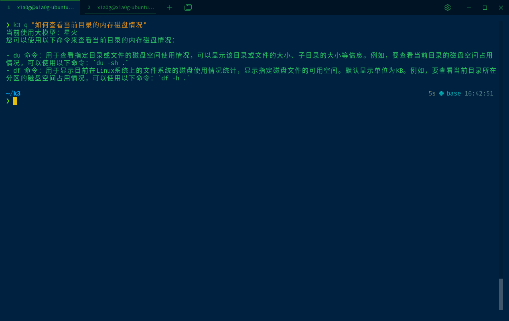

<center><font face="黑体" size=16>K3</font></center>

> 使用rust编写的命令行调用大模型工具，目前只支持星火，可以自由diy



## 基础命令

```rust
❯ k3
Usage: k3 <COMMAND>

Commands:
  init  Init K3
  q     Request LLM
  ts    timestemp to yyyy-MM-dd HH:mm:ss
  b64   base 64 to str
  help  Print this message or the help of the given subcommand(s)

Options:
  -h, --help     Print help
  -V, --version  Print version
```

## 安装方式

```bash
#下载
wget http://xxx/xx 
mkdir ~/k3d
cp ./k3 ~/k3d/k3
#添加到环境变量（以linux为例，windows自行添加即可）
export PATH=$PATH:/home/{你的用户名}/k3

```

## 编译安装

```

```

## 如何使用

```bash
#第一次首先x需要初始化
k3 init
#时间戳转换
k3 ts 1723870000  #秒级、毫秒级都可以
# base64解码
k3 b64 MTIz
#调用大模型
k3 q 你的问题
#ex：
k3 q "1+1=?"
k3 q "ls命令有什么作用"
```

